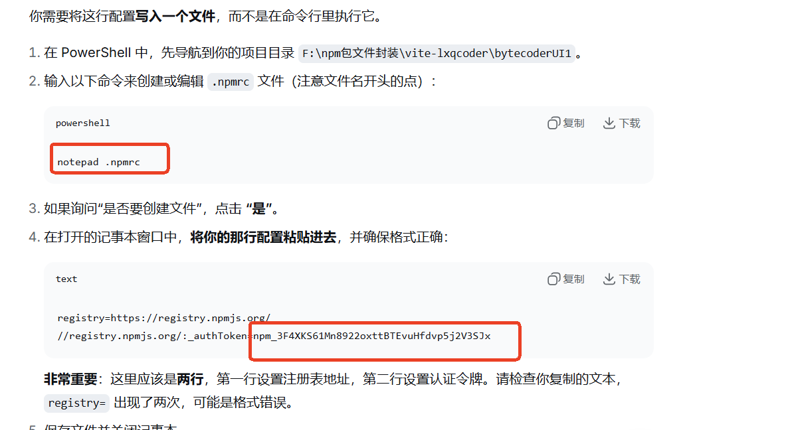

## npm 登录与发布

### 一、npm 登录步骤
1. 执行登录命令：
```bash
npm login
```
2. 按提示输入：
   - 用户名：lisir0
   - 密码:li36
   - 邮箱验证码

3. **如果遇到问题**，使用传统登录方式：
```bash
npm login --auth-type=legacy
```
   - 输入账号、密码
   - 输入 2 步验证的 token（如有开启）

### 二、安装与使用指南

#### 1. 安装依赖
由于本组件依赖其他库，**请按顺序安装**：

```bash
# 第一步：安装必要依赖
npm install element

# 第二步：安装本组件
npm install bytecoderui1
```

#### 2. 在项目中按需引入
```javascript
// 引入组件和样式
import { BannerCarousel, Menu } from 'bytecoderui1';
import 'bytecoderui1/bytecoderUI1.css';  // 全局样式

const app = createApp(App);

// 按需注册组件
app.component('li-menu', Menu);
app.component('li-banners', BannerCarousel);

app.mount("#app");
```

### 三、快速使用示例
```javascript
// 在你的 Vue 文件中直接使用
<template>
  <li-menu />
  <li-banners />
</template>
```